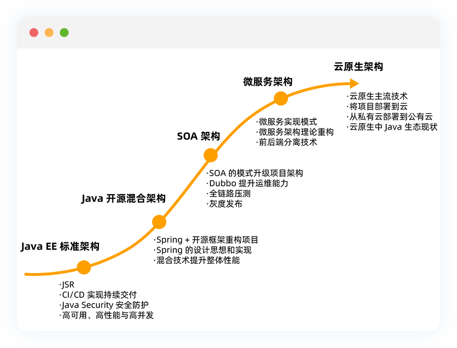

### What is this Repo
《小马哥的Java项目实战营》第 0 期的个人源码仓库，这是一个系统架构不断演进的练手项目

### Core points

- **Project requirements:** Focusing on Internet user service, discussing from the direction of technical system, R&D process and project management.
- **Technology System:** Overview of the features and usage scenarios of Java SE, Java EE and popular Java open source frameworks, including Netty, Dubbo, Spring, Spring Boot, Spring Cloud, Kubernetes, Docker, distributed system design, high concurrency, high availability, gRPC, Distributed cache, big data storage, message queue, sub-database sub-table, database tuning, etc.
- **Architecture evolution:** Discuss the details and development of traditional Java EE, SOA, microservices, Reactive and Cloud-Native architecture.



- **Project process:** Discuss the process, tools, division of labor and collaboration of various stages of Internet projects from project establishment to launch.
- **Quality Assurance:** Discuss the methods and experience of unit testing, integration testing, stand-alone stress testing, and full-link stress testing to improve service performance and stability and ensure safe production.
- **DevOps:** Integrated development and operation and maintenance, laying a solid foundation for the realization of CI/CD.

### Stages

- [Stage0 - Java EE standard architecture](wiki/stage-0/wiki/Stage0.md)
- Stage1 - Java open source hybrid architecture
- Stage2 - SOA architecture
- Stage3 - Microservice architecture
- Stage4 - Cloud native architecture


### HomeWork

#### Week01
- [x] 通过自研 Web MVC 框架实现（可以自己实现）一个用户注册，forward 到一个成功的页面（JSP 用法）/register
- [x] 通过 Controller -> Service -> Repository 实现（数据库实现）
- [ ] （非必须）JNDI 的方式获取数据库源（DataSource），在获取 Connection


#### Week02

- [x] 通过课堂上的简易版依赖注入和依赖查找，实现用户注册功能
- [x] 通过 UserService 实现用户注册注册用户需要校验
  - Id：必须大于 0 的整数
  - 密码：6-32 位 
  - 电话号码: 采用中国大陆方式（11 位校验）


#### Week03

**需求一（必须）**

- [x] 整合 [jolokia](https://jolokia.org/) 实现一个自定义 JMX MBean，通过 Jolokia 做 Servlet 代理

**需求二（选做）** 

- [ ] 继续完成 Microprofile config API 中的实现
  - 扩展 org.eclipse.microprofile.config.spi.ConfigSource 实现，包括 OS 环境变量，以及本地配置文件
  - 扩展 org.eclipse.microprofile.config.spi.Converter 实现，提供 String 类型到简单类型
- [ ] 通过 org.eclipse.microprofile.config.Config 读取当前应用名称,应用名称 property name = “application.name”

------

##### 需求一验证

（1） `git checkout homework-week03`

（2）访问 URL `http://127.0.0.1:8080/jolokia/read/org.geektimes.projects.user.management:type=User`

（3） 期望结果

```json
{"request":{"mbean":"org.geektimes.projects.user.management:type=User","type":"read"},"value":{"Email":"mercyblitz@gmail.com","User":{"password":"******","phoneNumber":"abcdefg","name":"小马哥","id":null,"email":"mercyblitz@gmail.com"},"PhoneNumber":"abcdefg","Id":null,"Name":"小马哥","Password":"******"},"timestamp":1615992674,"status":200}
```

（4）通过 jconsole 修改 MBean 属性Name为'瞿晓峰'，执行步骤（1）得到期望结果

```json
{"request":{"mbean":"org.geektimes.projects.user.management:type=User","type":"read"},"value":{"Email":"mercyblitz@gmail.com","User":{"password":"******","phoneNumber":"abcdefg","name":"瞿晓峰","id":null,"email":"mercyblitz@gmail.com"},"PhoneNumber":"abcdefg","Id":null,"Name":"瞿晓峰","Password":"******"},"timestamp":1615995343,"status":200}
```


#### Week04

- [x] 1.完善 my dependency-injection 模块
- 脱离 web.xml 配置实现 ComponentContext 自动初始化
- 使用独立模块并且能够在 user-web 中运行成功
- [ ] 2.完善 my-configuration 模块
- Config 对象如何能被 my-web-mvc 使用
- 可能在 ServletContext 获取如何通过 ThreadLocal 获取
- [ ] 3.去提前阅读 Servlet 规范中 Security 章节（Servlet 容器安全）

------

需求一

1、实现ServletContainerInitializer接口，在onStartUp方法中init ServletContext

```java
public class WebServletContainerInitializer implements ServletContainerInitializer {

    @Override
    public void onStartup(Set<Class<?>> c, ServletContext servletContext) throws ServletException {
        ComponentContext context = ComponentContext.getInstance();
        context.init(servletContext);
    }
}
```

2、删除web.xml 中ComponentContextInitializerListener配置

3、user-web 模块中依赖my-dependency-injection模块

4、编译打包运行user-web-v1-SNAPSHOT-war-exec.jar，访问`http://localhost:8080/hello/world`正常返回`Hello,World 2021`

需求二

#### Week05
 - [x] 修复本程序 org.geektimes.reactive.streams 包下
 - [x] 继续完善 my-rest-client POST 方法
 - [ ] (可选) 读一下 Servlet 3.0 关于 Servlet 异步 AsyncContext
